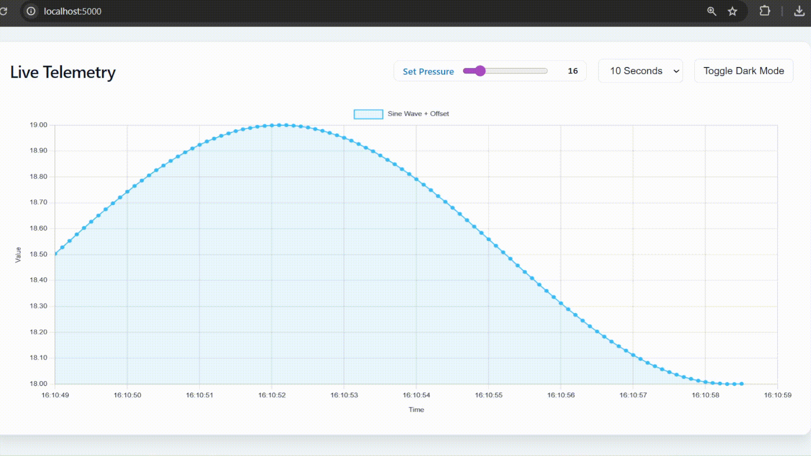
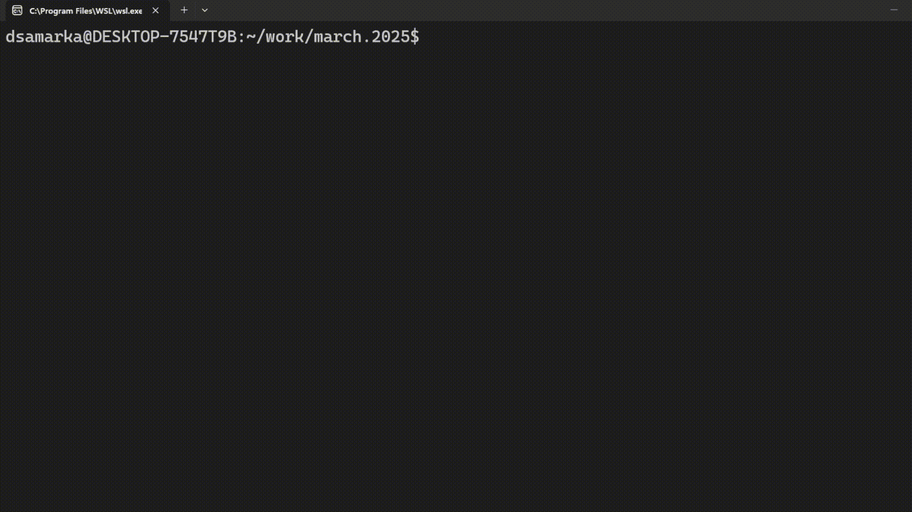
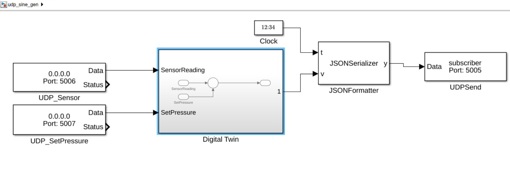

# Digital Twin with Simulink, Simulink Coder 

This project implements a portable Digital Twin (implemented in Simulink) that communicates over UDP with a Python-based components. It features a live data publisher, a subscriber, a digital twin, and a web dashboard for visualization. The application is deployed as a Docker composition.



## Architecture

- **Digital Twin (MATLAB/Simulink)**: A compiled C++ binary generated in Simulink (with Embedded Coder) that simulates a sine wave generator with UDP input/output blocks.
- **Publisher (Python)**: Sends input values to the Digital Twin Simulink model via UDP.
- **Subscriber (Python)**: Receives the processed signal from the Digital Twin.
- **Dashboard (Python/Flask)**: Visualizes the real-time data flow.

## Prerequisites

- Docker & Docker Compose to build the application
- (Optional) MATLAB, Simulink to open Simulink model
- (Optional) Instrument Control Toolbox to communicate over UDP
- (Optional) Simulink Coder to build a binary

## Getting Started

```bash
# Start the services (automatically pulls images from GitHub)
make up
```

The dashboard will be available at `http://localhost:5000`.



### Developer Setup


#### Opening the Simulink model

```matlab
>> openProject('.');
>> open_system('udp_sine_gen');
```



#### Generating C++ code and building the portable binary
```matlab
>> openProject('.');
>> generate_cpp_code
```

#### Generating Simulink model from scratch
You can regenerate the Simulink model with MATLAB script:

```matlab
>> openProject('.');
>> create_udp_simulink_model
```

## Makefile Commands

| Command | Description |
| :--- | :--- |
| `make build` | Generates MATLAB code and gathers dependencies into `bld/`. |
| `make up` | Starts the Docker composition (pulls from GHCR if `bld/` is missing). |
| `make down` | Stops services and cleans up shared data. |
| `make release TAG=v1.0.x` | Packages the local binary and creates a GitHub Release. |
| `make clean` | Removes all build artifacts and Docker images. |
