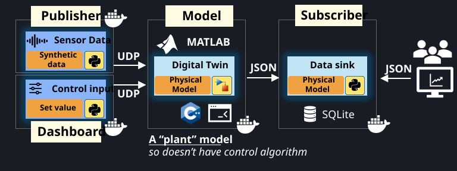
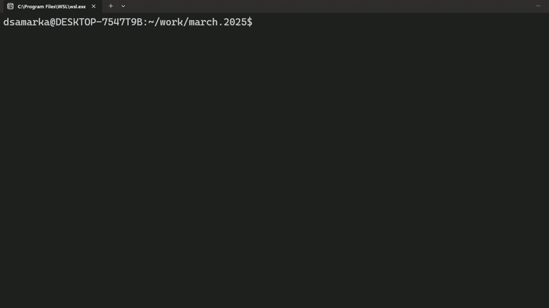
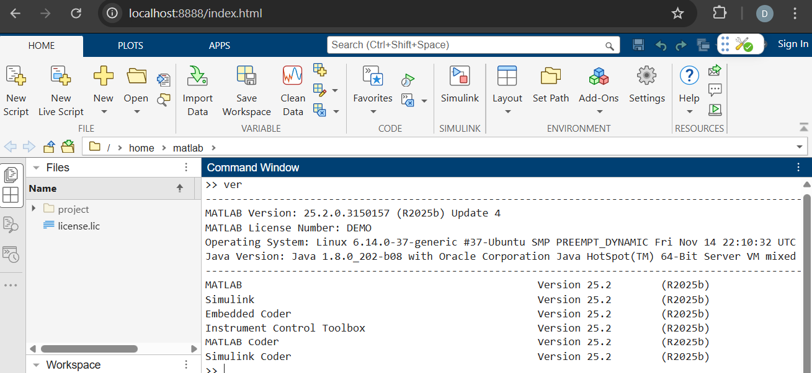
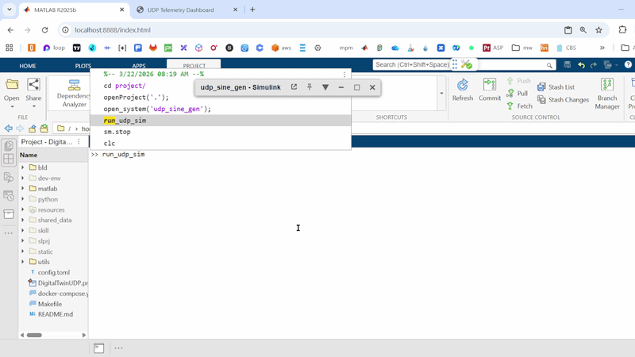

# Digital Twin with Simulink, Simulink Coder 

This project implements a portable Digital Twin (implemented in Simulink) that communicates over UDP with a Python-based components. It features a live data publisher, a subscriber, a digital twin, and a web dashboard for visualization. The application is deployed as a Docker composition.




## Architecture

- **Digital Twin (MATLAB/Simulink)**: A compiled C++ binary generated in Simulink (with Simulink Coder) that simulates a sine wave generator with UDP input/output blocks.
- **Publisher (Python)**: Sends input values to the Digital Twin Simulink model via UDP.
- **Subscriber (Python)**: Receives the processed signal from the Digital Twin.
- **Dashboard (Python/Flask)**: Visualizes the real-time data flow.

## Prerequisites

- Docker & Docker Compose to build the application
- (Optional) MATLAB, Simulink to open Simulink model
- (Optional) Instrument Control Toolbox to communicate over UDP
- (Optional) Simulink Coder, Embedded Coder to build a binary

## Getting Started

```bash
# Start the services (automatically pulls images from GitHub)
make up-prod
```

The dashboard will be available at `http://localhost:5000`.



### Developer Setup

#### Build and Starting Development Stack
```bash
make up-dev
```
Then, open your browser and navigate to `http://localhost:8888/`. This will open MATLAB using online licensing by default. Once signed in, a MATLAB session will start, and you will be ready to develop your code.

If you wish to use a local license file or a license server instead of online licensing, provide a value for `matlab_license_file` in [config.toml](./config.toml).

The MATLAB environment comes with all necessary toolboxes for this project pre-installed and ready to use.



#### Opening the Simulink model

```matlab
>> cd project;
>> openProject('.');
>> open_system('udp_sine_gen');
```

#### Starting the Simulink model
As part of the development stack, the UDP infrastructure is up and running; there are senders that publish data and a subscriber that listens for incoming data. You can start the Simulink model and open the dashboard to see the data flow live.




#### Generating C++ code and building the portable binary
```matlab
>> openProject('.');
>> generate_cpp_code
```

#### Generating Simulink model from scratch
You can regenerate the Simulink model with MATLAB script:

```matlab
>> openProject('.');
>> create_udp_simulink_model
```

## Makefile Commands

| Command | Description |
| :--- | :--- |
| `make up-prod` | Start full stack including production Digital Twin binary (default). |
| `make up-dev` | Start stack with MATLAB interactive development container. |
| `make down` | Stop services and cleanup. |
| `make logs` | Follow Docker Compose logs. |
| `make ps` | List running services and their status. |
| `make release TAG=v1.0.x` | Build, zip, and create a GitHub Release. |
| `make build` | Build the MATLAB binary and gather dependencies. |
| `make clean` | Remove Docker images and build artifacts. |

